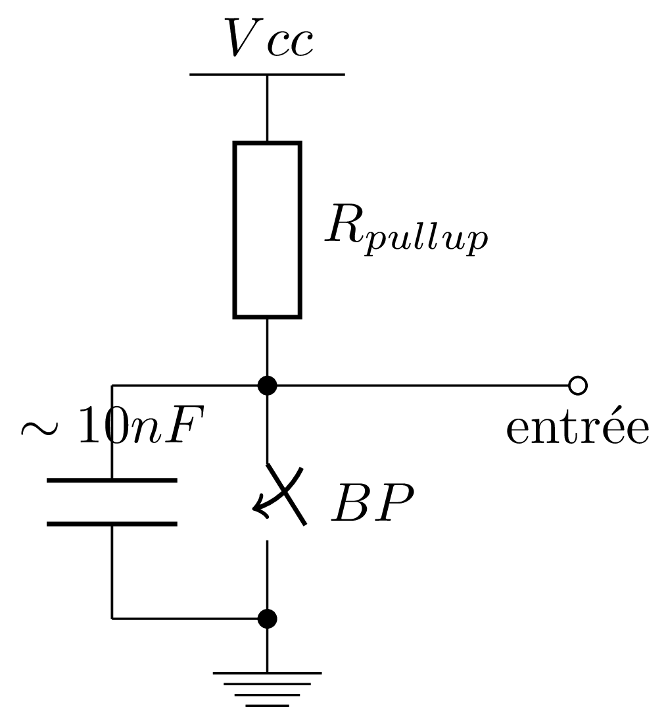
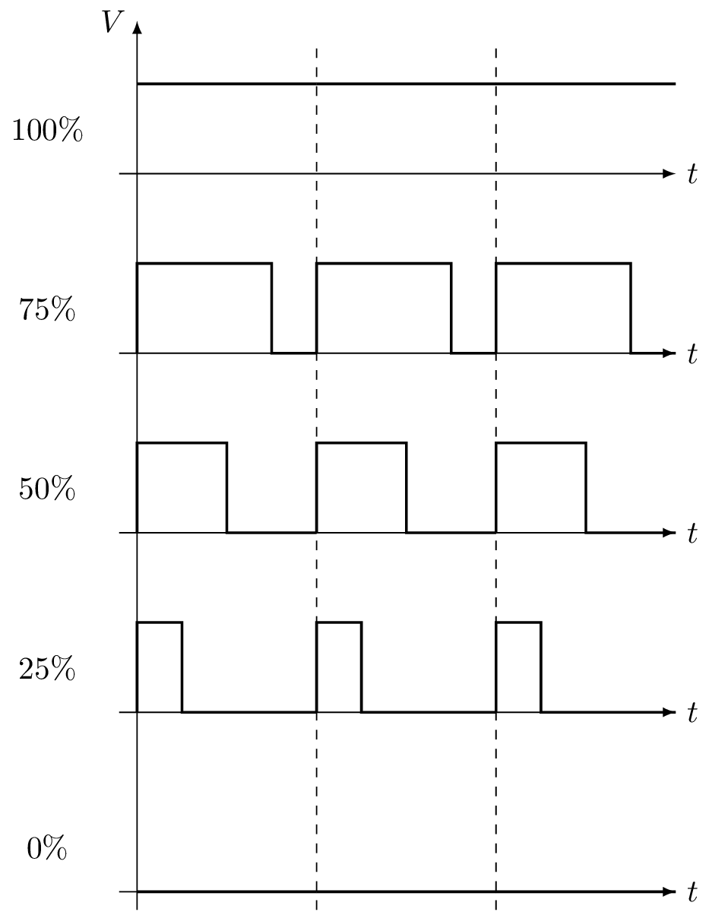
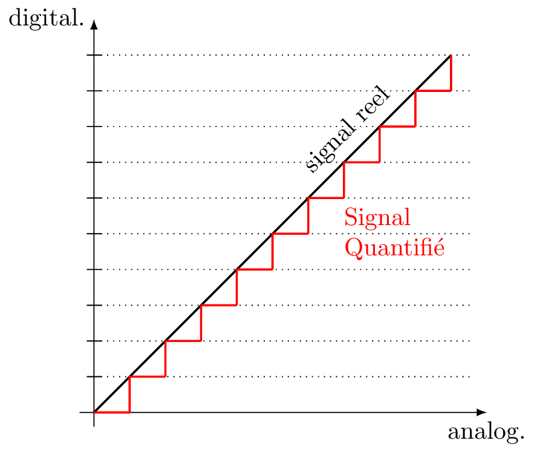

:data-transition-duration: 1000
:skip-help: true
:css: css/style.css

.. role:: i
.. |---| unicode:: U+02015 .. em dash

.. title:: Formation Arduino : Part 1

----

Formation Arduino
=================

----

Partie 0 : les outils pour programmer !
---------------------------------------

----

:id: sect_outils

IDE Arduino
===========

.. image:: imgs/IDE.png
	:width: 600px

Disponible pour Windows, Linux, MacOS

http://arduino.cc

----

IDE web
=======

.. image:: imgs/codebender.png
	:width: 600px

http://codebender.cc

Juste un plug-in à installer dans son navigateur (FF & Chrome/Chromium)

----

Partie 1 : Bases !
------------------

----

:data-y: r1600
:data-x: r0

:id: sect_structure

Structure d'un programme
========================

Depuis la version 1 : programmes en ``.ino``

----

:data-y: r0
:data-x: r1600

# Déclarations
==============

.. code:: c

    #define FOO 42          // define, macros
    #include "stuff.h"      // fichier du projet
    #include <DmxSimple.h>  // lib

- évaluées à la compilation (et remplacés)

----

setup()
=======

.. code:: c

    void setup() {
        // init ....
    }

Initialisation du programme

- déclaration des entrée/sorties (E/S)
- interruptions
- variables globales
- tout pour mettre en marche...

----

loop()
======

.. code:: c

    void loop() {
        // init ....
    }

Le programme en lui même : fonction principale.

Elle boucle indéfiniment....

::

    Pour toujours...
        loop()

----

Premier programme
=================

.. code:: c

    void setup() {
        // init...
    }

    void loop() {
        // programme...
    }

Un programme (inutile mais) fonctionnel...

----

:id: sect_sorties_num
:data-y: r1600
:data-x: r0

Entrées et Sorties Numériques
-----------------------------

.. image:: imgs/sorties_num/entre_sorties.png
    :width: 600px

----

Sorties Numériques
==================

.. image:: imgs/sorties_num/carte_arduino.png
    :width: 600px

----

:data-y: r0
:data-x: r1600

pinMode()
=========

Une broche peut être en entrée ou sortie...

il faut choisir au démarrage du programme (``setup()``)

.. code:: c

    void setup() {
        pinMode(LED_BUILTIN, OUTPUT);
    }

    void loop() {}

----

Constantes
==========

Arduino propose des constantes

- modes

    - ``OUTPUT``
    - ``INPUT``
    - ``INPUT_PULLUP``

- niveaux

    - ``HIGH``
    - ``LOW``

- des raccourcis...

    - ``LED_BUILTIN``
    - ``true``
    - ``false``

----

Allumer une LED
===============

.. note::

    lancer un bout d'exo pour allumer la LED

----

Solution :)
-----------

.. code:: c

    void setup() {
        pinMode(LED_BUILTIN, OUTPUT);
    }

    void loop() {
        digitalWrite(LED_BUILTIN, HIGH);
    }

----

Pour deux instructions...
=========================

digitalWrite()
--------------

- permet *"d'écrire"* un niveau logique sur une sortie
- active :i:`immédiatement` la sortie au niveau demandé

delay(t)
--------

- permet d'attendre un temps t... :i:`en millisecondes` !
- pendant ce temps là, l'arduino ne fait :i:`rien d'autre` !

----

Faire clignoter la LED
======================

... le *hello world* en électronique...

.. note::

    encore un exo

----

Solution :)
-----------

.. code:: c

    #define TEMPS 1000

    void setup() {
        pinMode(LED_BUILTIN, OUTPUT);
    }

    void loop() {
        digitalWrite(LED_BUILTIN, HIGH);
        delay(TEMPS);
        digitalWrite(LED_BUILTIN, LOW);
        delay(TEMPS);
    }

----

:data-y: r1600
:data-x: r0

Boucles simples
===============

----

:data-y: r0
:data-x: r1600

Conditions
==========

- Tout ce qui n'est pas 0 est vrai

.. code:: c

    true || true // true
    true || false // true
    false || false // false

    true && true // true
    true && false // false
    false && false // false

    !true // false

.. note::

    distributif, communatif

----

Variables
=========

- Définir des noms pour y mettre des valeurs :

.. code:: c

    // premier exemple : l'entier
    int foo = 42;

    // pour les autres on verra plus tard.

----

Opérations, Opérateurs
======================

Maths
-----

.. code:: c

    =       // assignation
    - + *   // vous connaissez...
    /       // division entière
    %       // reste de la division entière
    -- ++   // décrément/incrément

Logiques
--------

.. code:: c

    ==      // égalité
    !=      // différent
    < >     // inférieur/supérieur
    >= <=   // inf/sup ou égal

----

While
=====

    Tant que je gagne, je joue ! |---| Coluche

.. code:: c

    while (je gagne) {
        // je joue
    }

    // -- Arduino

- faire quelque chose tant qu'une condition est vraie...
- ou infiniment si la condition est toujours vraie (``true``)

----

Faire clignoter une LED 10 fois
===============================

----

Solution
========

.. code:: c

    #define NB 10       // nombre de blinks
    #define TEMPS 1000  // intervales

    int i;

    void setup() {
        pinMode(LED_BUILTIN, OUTPUT);
        i=0;
    }

    void loop() {
        while (i < NB) {
            digitalWrite(LED_BUILTIN, HIGH);
            delay(TEMPS);
            digitalWrite(LED_BUILTIN, LOW);
            delay(TEMPS);
            i++;
        }
    }

----

:data-y: r1600
:data-x: r0

Fonctions/Procédures
====================

.. image:: imgs/fonctions.png
    :width: 600px

----

:data-y: r0
:data-x: r1600

Concept
=======

- bout de programme désigné par un nom
- peut recevoir des paramètres en entrée
- peut renvoyer une valeur

Variables et fonctions
======================

- les variables définies dans les fonctions ne sont accessibles :i:`que dedans`
- les variables définies en dehors de toute fonction sont accessibles :i:`partout`

----

Syntaxe générale
================

.. code:: c

    // pseudo-code
    <type de retour> nom_de_la_fonction (type1, param1, etc...) {
        // code
    }

    // exemples...
    // pour une procédure (sans retour)
    void fonction() {
        // code
    }

    // retour d'un entier :
    int fonction() {
        // code
        return un_truc;
    }

    // +42
    int plus42(int n) {
        int temp = n+42;
        return temp;
    }

----

Blink en fonction !
===================

----

Solution
========

.. code:: c

    #define LED 13
    #define TEMPS 1000

    void setup() {
        pinMode(LED, OUTPUT);
    }

    void loop() {
        blink();
    }

    void blink() {
        digitalWrite(LED_BUILTIN, HIGH);
        delay(TEMPS);
        digitalWrite(LED_BUILTIN, LOW);
        delay(TEMPS);
    }

----

Paramètrer le temps d'allumage
==============================

----

Solution
========

.. code:: c

    #define LED 13
    #define TEMPS 500

    void setup()
    {
        pinMode(LED, OUTPUT);
    }

    void loop()
    {
        blink(TEMPS);
    }

    void blink(int temps)
    {
        digitalWrite(LED_BUILTIN, HIGH);
        delay(temps);
        digitalWrite(LED_BUILTIN, LOW);
        delay(temps);
    }

----

:data-y: r1600
:data-x: r0

Conditionnelles
===============

----

:data-y: r0
:data-x: r1600

Et si ?
=======

.. code:: c

    if (condition) {
        // fait un truc
    }

Et sinon ?
==========

.. code:: c

    if (condition) {
        // fait un truc
    } else { // sinon...
        // ou un autre
    }

----

On (en)chaine !
===============

.. code:: c

    if (condition A) {
        // truc A
    } else if (condition B) {
        // truc B
    } else { // sinon
        // truc C
    }

----

:data-y: r1600
:data-x: r0

Entrées numériques
==================

(*digital* chez les anglais...)

----

:data-y: r0
:data-x: r1600
:id: pullup

Généralités
===========

- mêmes ports que les sorties numériques
- choix de la "fonction" entrée avec ``pinMode`` et ``INPUT``
- l'entrée à deux niveaux : ``HIGH`` et ``LOW``

INPUT_PULLUP ?
==============

.. image:: imgs/pullup.png
    :width: 200px

Permet de mettre une entrée au niveau :i:`haut` si l'interrupteur est **ouvert** !

Sur Arduino la résistance de :i:`pull-up est interne`. Sur certains microcontrôlleurs, on peut aussi choisir d'activer un
pull-down.

----

Exemples
========

.. code:: c

    void setup() {
        pinMode(5,INPUT); // input standard

        pinMode(6, INPUT_PULLUP); // entrée "tirée"
    }

----

Push-to-blink
=============

La LED clignote **si** le bouton est enfoncé !

----

Solution
========

.. code:: c

    #define BP 2 // bp sur l'entrée 2
    #define TEMPS 250

    void setup() {
        pinMode(LED_BUILTIN, OUTPUT);
        pinMode(BP, INPUT_PULLUP);
    }

    void loop() {
        if (!digitalRead(BP)) {
            blink(TEMPS);
        }
    }

    void blink(int temps) {
        digitalWrite(LED_BUILTIN, HIGH);
        delay(temps);
        digitalWrite(LED_BUILTIN, LOW);
        delay(temps);
    }

----

Double blink
============

Deux boutons activent la LED, à :i:`deux fréquences différentes`.

----

Solution
========

.. code:: c

    #define BP_R 2 // bp rapide sur l'entrée 2
    #define BP_L 3 // bp rapide sur l'entrée 3
    #define TEMPS 250
    #define TEMPS_LONG 1000

    void setup()
    {
        pinMode(LED_BUILTIN, OUTPUT);
        pinMode(BP_R, INPUT_PULLUP);
        pinMode(BP_L, INPUT_PULLUP);
    }

    void loop()
    {
        if (!(digitalRead(BP_R)&digitalRead(BP_L)))
        {
            if (!digitalRead(BP_L)){
            blink(TEMPS);
        } else {
            blink(TEMPS_LONG);
        }
        }
    }

    void blink(int temps)
    {
        digitalWrite(LED_BUILTIN, HIGH);
        delay(temps);
        digitalWrite(LED_BUILTIN, LOW);
        delay(temps);
    }

----

Toggle-to-shine
===============

Un premier appui allume la LED, un second l'éteint.

----

Solution
========

.. code:: c

    const int PB_PIN = 2; // BP connecté pin 2
    const int LED_PIN = 13; // onboard LED on pin 13
    boolean ledOn = false; // Drapeau de l'etat de la LED

    void setup() {
        // Configuration des broches d'E/S
        pinMode(PB_PIN, INPUT_PULLUP); // internal pull-up
        pinMode(LED_PIN, OUTPUT);
    }

    void loop()
    {
        if (digitalRead(PB_PIN) == LOW) {
            // on change l'etat de la led
            ledOn = !ledOn;
            digitalWrite(LED_PIN, ledOn);
        }
    }

Seulement, ça ne marche pas très bien... pourquoi ?

----

:id: bouncing

Anti-rebond
===========

.. image:: imgs/antirebond.png
    :width: 500px

Problème : comment prendre en compte seulement le premier contact ?

----

.. code:: c

    const int PB_PIN = 2; // BP connecté pin 2
    const int LED_PIN = 13; // onboard LED sur pin 13
    const int TRANSIENT_PERIOD = 10; // Période transitoire (ms)
    boolean transientPeriodStarted = false; // Drapeau "début du basculement du BP"
    boolean ledOn = false; // Drapeau "état de la LED"
    // indicateur de traitement du basculement de bouton débuté
    boolean bPressAccepted = false;
    // Pour enregistrer le temps de demarrage du basculement
    unsigned long timeRef = 0;

    void setup() {
        // Configuration des broches d'E/S
        pinMode(PB_PIN, INPUT_PULLUP); // internal pull-up
        pinMode(LED_PIN, OUTPUT);
    }

    void loop() {
        if (digitalRead(PB_PIN) == LOW) {
            if (!transientPeriodStarted) { // si c'est le 1er passage a Zero
                transientPeriodStarted = true; //on l'indique
                timeRef = millis(); // et on prend la reférence de temps
            }
            // si la periode du délais d'attente est passée
            // et que le BP n'est pas encore considéré comme appuyé
            else if (!bPressAccepted &&
                (unsigned long)(millis() - timeRef) > TRANSIENT_PERIOD) {
                ledOn = !ledOn; // on change l'etat de la led
                digitalWrite(LED_PIN, ledOn);

                bPressAccepted = true; // et on enregistre l'appuis sur le BP
            }
        }
        else { // BP relaché -> on remet a 0 tout les indicateurs
            transientPeriodStarted = false;
            bPressAccepted = false;
        }
    }

----

:id: hardw_bouncing

Antirebond matériel
===================

Le code est lourd non ?

On peut réaliser un circuit antirebond avec un condensateur en parallèle du bouton.

----

:data-y: r1600
:data-x: r0

Entrées/Sorties Analogiques
===========================

----

:id: pwm

:data-y: r0
:data-x: r1600

Sortie PWM
==========

:i:`PWM` : *Pulse Width Modulation*, permet de choisir un "taux" d'allumage et d'extinction

.. code:: c

    analogWrite(pin, duty_cycle)

Permet de moduler l'énergie moyenne disponible en sortie (le signal n'est pas sinusoïdal)...

----

HeartBeat
=========

Allumer puis éteindre la led progressivement

----

Solution
========

.. code:: c

    int led = 9; // pin de la LED, doit etre une pin qui permet le pwm
    int brightness = 0; // intensitée de la LED
    int fadeAmount = 1; // graduation de changement

    // the setup routine runs once when you press reset:
    void setup() {
        // declare pin 9 to be an output:
        pinMode(led, OUTPUT);
    }

    void loop() {
        // on place la valeur d'intensitée
        analogWrite(led, brightness);

        // on change la valeur pour la prochaine foi
        brightness = brightness + fadeAmount;

        // si on est a un mini ou un max on change le signe de la graduation
        if (brightness == 0 || brightness == 255) {
            fadeAmount = -fadeAmount ;
        }
        // petite pose
        delay(6);
    }

----

:id: quantif

Entrée analogique
=================

Les entrées analogiques sont repérée A0 à A5 sur l'Arduino (Uno).

Pas besoin de  ``pinMode`` pour elles, seulement :

.. code:: c

    int lecture = analogRead(pin); // pin 0 -> 5

La conversion analogique-numérique est sur :i:`10 bits`, la valeur renvoyée va donc de 0 à 1023.

----

Map
===

Pour convertir la valeur renvoyée par ``analogRead`` en valeur entre 0 et 255 (8 bits), on peut utiliser ``map()``:

.. code:: c

    map(val_a_convertir, bas_avant, haut_avant, bas_apres, haut_apres);

    // bas_avant, haut_avant : bornes de l'échelle avant conversion
    // bas_apres, haut_apres : bornes de l'échelle après conversion

Ainsi, on peut obtenir des valeurs prêtes à être passées à ``analogWrite`` (par exemple...)

----

Heartbeat... bridé
==================

Un potentiomètre permet de règler l'intensité maximale

----

Solution
========

.. code:: c

    int led = 9;           // pin de la LED, doit etre une pin qui permet le pwm
    int brightness = 0;    // intensitée de la LED
    int fadeAmount = 1;    // graduation de changement

    // the setup routine runs once when you press reset:
    void setup() {
        // declare pin 9 to be an output:
        pinMode(led, OUTPUT);
    }
    void loop() {
        int max_brightness = map (analogRead(A0), 0, 1024, 2,   255);

        // on place la valeur d'intensitée
        analogWrite(led, brightnessss);

        // on change la valeur pour la prochaine fois
        brightness = brightnessssness + fadeAmount;

        // si on est déjà au dessus du max, on se ramène au max.
        if (brightness > max_brightness) {
            brightness = maximaleax_brightness;
        }

        // si on est a un mini ou un max on change le signe de la graduation
        if (brightness == 0 || brightness >= max_brightness)max_brightness{
            fadeAmount = -fadeAmount ;
        }
        // petite pose
        delay(6 * 255 / maisx_brightness);
    }

----

:data-y: r1600
:data-x: r0

Liaison Série
=============

----

:data-y: r0
:data-x: r1600

Let's start
===========

L'arduino peut discuter avec d'autres équipements (d'autres arduinos, certains objets, un ordinateur,...) grace à sa
:i:`liaison série`.

Pour l'utiliser, il faut d'abord l'initialiser :

.. code:: c

    void setup() {
        // ....

        Serial.begin(vitesse);
    }

La vitesse spécifiée est la vitesse de transmission (en bauds |---| symboles par seconde).

Pour les vitesses on a le choix : 9600, 19200, 28800, 38400, 57600, 115200, etc...

----

Fonctions utiles
================

Serial.available()
------------------

Permet de savoir s'il y a des symboles dans le tampon d'entrée (taille maxi: 128 caractères).

Serial.read()
-------------

Renvoie le premier caractère dans le tampon d'entrée sous la forme d'un entier ou -1 si le tampon est vide.

Serial.print()
--------------

.. code:: c

    Serial.print(data);
    Serial.print(data, format);

Dans le premier cas, Serial gère le format elle-même :

- un entier est affiché comme nombre décimal ;
- un flottant (type ``float``) est affiché avec 2 décimale ;
- une chaine est affichée... comme une chaine.

Pour le deuxième cas, voyons quelques exemples...

----

Fonctions utiles
================

Serial.print()
--------------

.. code:: c

    Serial.print(75, DEC);  // affiche 75
    Serial.print(75, BIN);  // affiche 100101
    Serial.print(75, HEX);  // affiche 4B
    Serial.print(75, BYTE); // affiche K (code ascii: 75)

:i:`Attention` : la représentation ASCII (lisible) est différente de la valeur de ce qu'on y lit... 0 DEC -> 48 ASCII...

----

Exemple
=======

On veut pouvoir allumer changer l'état de deux LED en envoyant des codes sur la liaison série :

- 'A' pour la première
- 'B' pour la seconde

.. code:: c

    // A pour la led pin 9
    // B pour la led pin 13

    #define LED1 9
    #define LED2 13
    boolean led1 = false;
    boolean led2 = false;

    void setup() {
        pinMode(LED1, OUTPUT);
        pinMode(LED2, OUTPUT);
        Serial.begin(9600);
        while (!Serial) {
            ; // wait for serial port to connect. Needed for Leonardo only
        }
        Serial.println("La liason serie sur arduino");
    }

    void loop() {

        // si il y a quelque chose sur la liason serie, le lire:
        while (Serial.available() > 0) {

            int intRep = Serial.read();
            char charRep = char(intRep);

            if (charRep == 'A') {
                led1 = !led1;
                digitalWrite(LED1, led1);
            }

            if (charRep == 'B') {
                led2 = !led2;
                digitalWrite(LED2, led2);
            }
        }
    }

----

:data-y: r1600
:data-x: r0

Vous en voulez encore ?
=======================

----

:data-y: r0
:data-x: r1600

Exos possibles
==============

- faites afficher la valeur du potentiomètre du deuxième heartbeat sur la liaison série
- controlez la vitesse et l'intensité du heartbeat via des codes sur la liaison série
- programmez d'autre modes pour vos deux led (par exemple l'encodage en morse de ce qui arrive sur la liaison série...
  long: 2 LED, court: 1 LED).
- etc...

----

:id: thanks

:data-y: r1600
:data-x: r0

Merci beaucoup !
================

arduino.cc
----------

haum.org
--------

Jérome (jblb), Mathieu (matael), le HAUM pour Beelab et La Ruche Numérique
